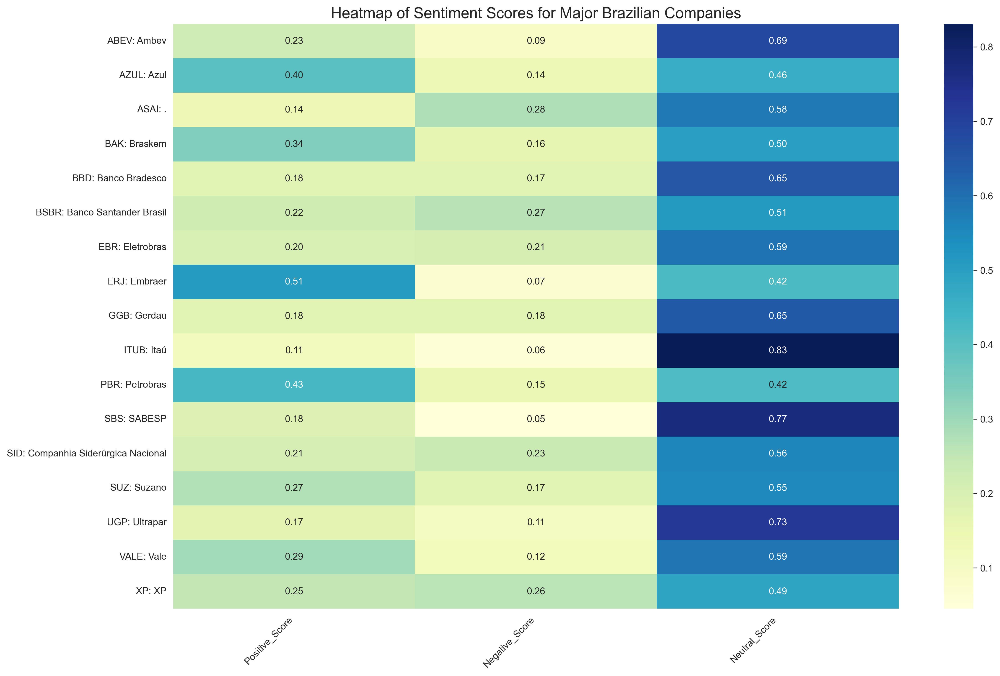
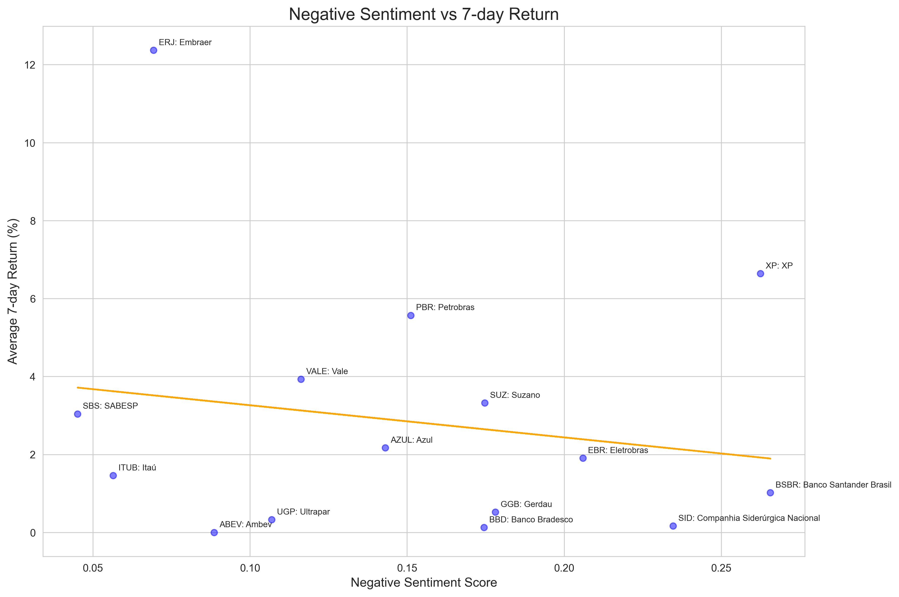
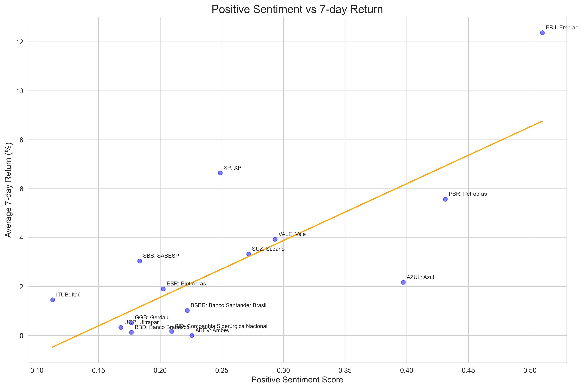
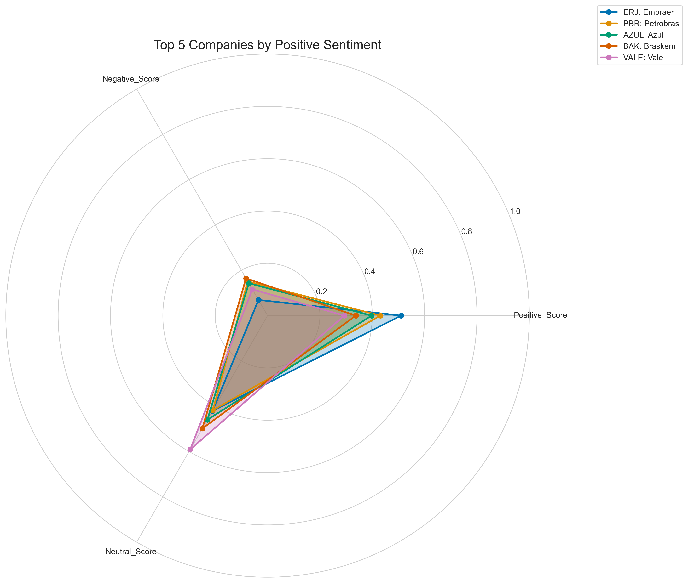

# Análise de Sentimento e Retorno de Ações Brasileiras

## Visão Geral
Este projeto realiza uma análise abrangente de ações brasileiras, combinando web scraping, análise de sentimento de notícias e análise de retornos financeiros. O objetivo é investigar a relação entre o sentimento das notícias e o desempenho das ações no mercado brasileiro. O projeto foca no site FinViz, pois o mesmo possui uma distribuição de notícias relacionadas à ações em formato de tabela, com uma distribuição por tickers, facilitando assim o processo de extração de dados. 

## Estrutura do Projeto
```
SENTIMENT_ANALYSIS/
├── br_market/
│   ├── data/
│   │   ├── final/
│   │   ├── processed/
│   │   └── raw/
│   └── src/
│       ├── analysis/
│       │   ├── pngs/
│       │   │   ├── n_sentiment_vs_return_scatter_positive_with_trendline.png
│       │   │   ├── overall_sentiment_distribution_finbert.png
│       │   │   ├── sentiment_correlation.png
│       │   │   ├── sentiment_distribution_boxplot.png
│       │   │   ├── sentiment_heatmap.png
│       │   │   ├── sentiment_vs_return_scatter_positive_with_trendline.png
│       │   │   ├── top_5_companies_radar_negative.png
│       │   │   ├── top_5_companies_radar_positive.png
│       │   │   └── top_10_negative_tickers.png
│       │   ├── analysis.ipynb
│       │   └── README.md
│       ├── scraper/
│       │   └── main.ipynb
|       |   └── README.md
│       └── sentiment_analysis/
│           ├── transform/
│           │   ├── README.md
│           │   └── transform.py
│           └── main.ipynb
├── sentiment_env/
├── .gitignore
├── README.md
├── LICENSE
└── requirements.txt
```

## Componentes Principais

1. **Web Scraping (src/analysis/main.ipynb)**
   - Coleta notícias relacionadas a ações brasileiras.
   - Gera arquivos CSV com dados de notícias.

2. **Análise de Sentimento (src/sentiment_analysis/main.ipynb)**
   - Utiliza o modelo FinBERT para analisar o sentimento dos títulos das notícias.
   - Gera scores de sentimento positivo, negativo e neutro.

3. **Análise de Retornos e Visualização (src/analysis/analysis.ipynb)**
   - Calcula retornos de 1, 3 e 7 dias para cada ação.
   - Combina dados de sentimento com retornos financeiros.
   - Cria visualizações para interpretar os resultados.

## Como Usar

1. Clone o repositório:
   ```
   git clone [URL do repositório]
   ```

2. Instale as dependências:
   ```
   pip install -r requirements.txt
   ```

3. Execute os arquivos na seguinte ordem:
   - `src/scraper/main.py`
   - `src/analysis/main.ipynb`
   - `src/sentiment_analysis/main.ipynb`
   - `src/analysis/analysis.ipynb`

Resultados Principais e Análises
1. Distribuição de Sentimento


A maioria das empresas apresenta scores neutros mais altos, indicando uma cobertura de notícias geralmente equilibrada.
Empresas como Itaú (ITUB), SABESP (SBS) e Ultrapar (UGP) têm os maiores scores neutros.
ERJ (Embraer) e PBR (Petrobras) se destacam com os maiores scores positivos.
BSBR (Banco Santander Brasil) e SID (Companhia Siderúrgica Nacional) têm os maiores scores negativos.

2. Relação entre Sentimento Negativo e Retorno


Há uma leve tendência negativa, sugerindo que scores negativos mais altos estão associados a retornos menores.
ERJ (Embraer) é um outlier notável, com alto retorno apesar de um score negativo médio.
Empresas como BSBR e SID, com scores negativos mais altos, tendem a ter retornos menores.

3. Relação entre Sentimento Positivo e Retorno


Existe uma clara tendência positiva, indicando que scores positivos mais altos estão associados a maiores retornos.
ERJ (Embraer) novamente se destaca com o maior retorno e um dos maiores scores positivos.
PBR (Petrobras) e XP também mostram uma forte relação entre sentimento positivo e retorno.

4. Top 5 Empresas por Sentimento Positivo


ERJ (Embraer) lidera em sentimento positivo.
PBR (Petrobras), AZUL, BAK (Braskem) e VALE completam o top 5.
Essas empresas têm um equilíbrio interessante entre scores positivos, negativos e neutros, com tendência para o positivo.

Conclusões Gerais

Existe uma correlação mais forte entre sentimento positivo e retornos do que entre sentimento negativo e retornos.
Embraer (ERJ) é um caso notável, com alto sentimento positivo e retornos excepcionais.
O setor de energia (Petrobras) e aviação (Embraer, Azul) parecem ser particularmente sensíveis ao sentimento das notícias.
A maioria das empresas tem um alto score neutro, sugerindo que o mercado brasileiro pode ser menos volátil a notícias do que se poderia esperar.
Empresas do setor financeiro (como Itaú e Banco Bradesco) tendem a ter scores mais neutros, possivelmente refletindo uma cobertura de notícias mais equilibrada.

Implicações para Investidores

O sentimento positivo das notícias parece ter um impacto mais significativo nos retornos de curto prazo do que o sentimento negativo.
Setores como aviação e energia merecem atenção especial, dada sua sensibilidade ao sentimento das notícias.
A predominância de scores neutros sugere que o mercado brasileiro pode ser menos volátil a notícias do que se poderia esperar inicialmente.

## Implicações para Investidores

1. O sentimento positivo das notícias parece ter um impacto mais significativo nos retornos de curto prazo do que o sentimento negativo.
2. Setores como aviação e energia merecem atenção especial, dada sua sensibilidade ao sentimento das notícias.
3. A predominância de scores neutros sugere que a maioria dos títulos das notícias tende a ter uma imparcialidade maior, não querendo expor de cara o conteúdo da mesma.

## Tecnologias Utilizadas

- Python
- Pandas, NumPy
- Matplotlib, Seaborn
- BeautifulSoup, Requests
- Transformers (FinBERT)
- yfinance

## Contribuições

Contribuições são bem-vindas!

## Licença

Este projeto está sob a licença MIT. Veja o arquivo `LICENSE` para mais detalhes.

## Contato

Bernardo Steffen Timm - bernardo.timm@hotmail.com

