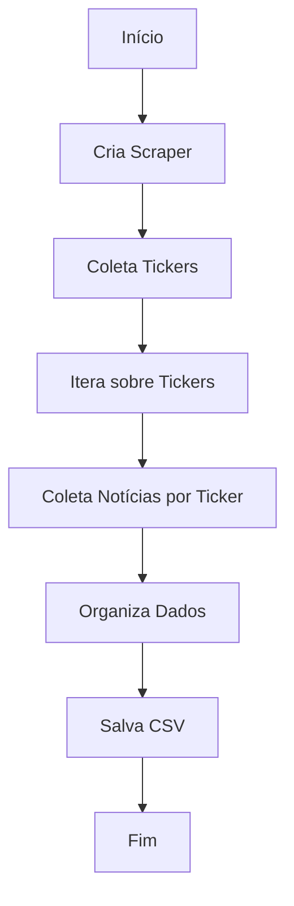

# Web Scraper de Notícias de Ações Brasileiras

## Visão Geral

Este script Python realiza as seguintes operações:

- Extrai tickers de ações brasileiras do Finviz
- Coleta notícias relacionadas a cada ação
- Utiliza técnicas anti-bloqueio para evitar detecção
- Gera um arquivo CSV com os dados coletados

## Requisitos

```
- Python 3.x
- cloudscraper
- beautifulsoup4
- pandas
```

## Estrutura do Código

### Funções Principais

1. `create_scraper()`
   - Cria uma instância do cloudscraper
   - Retorna: objeto scraper

2. `get_random_user_agent()`
   - Seleciona um User-Agent aleatório
   - Retorna: string com User-Agent

3. `get_page_content(url, scraper)`
   - Obtém o conteúdo HTML de uma página
   - Parâmetros:
     - `url`: URL da página
     - `scraper`: instância do cloudscraper
   - Retorna: string com HTML ou None em caso de falha

4. `get_tickers_from_page(page_number, scraper)`
   - Extrai tickers de uma página específica do Finviz
   - Retorna: lista de tickers

5. `get_all_tickers(scraper)`
   - Coleta tickers de múltiplas páginas
   - Retorna: lista completa de tickers

6. `get_company_and_news_links(ticker, scraper)`
   - Obtém nome da empresa e notícias relacionadas
   - Retorna: tuple (nome da empresa, lista de notícias)

7. `main()`
   - Função principal que orquestra todo o processo

### Fluxo de Execução



## Uso

1. Prepare o ambiente:
   ```bash
   pip install cloudscraper beautifulsoup4 pandas
   ```

2. Execute o script:
   ```bash
   python script_scraper_noticias_acoes.py
   ```

3. Arquivo gerado:
   - `brazilian_stocks_[DATA]_news.csv`

## Customização

- Páginas a serem coletadas: Ajuste o range em `get_all_tickers()` (atualmente páginas 1 e 2)
- User-Agents: Adicione ou modifique a lista em `get_random_user_agent()`
- Delay entre requisições: Altere os valores em `time.sleep(random.uniform(0.5, 1))`

## Notas

- O script utiliza técnicas para evitar detecção e bloqueio
- A coleta de dados pode levar alguns minutos, dependendo do número de ações
- Respeite os termos de serviço do Finviz ao utilizar este script

## Resolução de Problemas

Se encontrar erros:
1. Verifique sua conexão com a internet
2. Confirme se todas as bibliotecas estão instaladas corretamente
3. Caso ocorram bloqueios frequentes, aumente o delay entre as requisições

## Considerações Éticas e Legais

- Este script é para fins educacionais
- Considere obter permissão explícita para web scraping em ambientes de produção

## Contribuições

Contribuições são bem-vindas! Por favor, abra uma issue ou pull request para sugestões de melhorias ou correções.