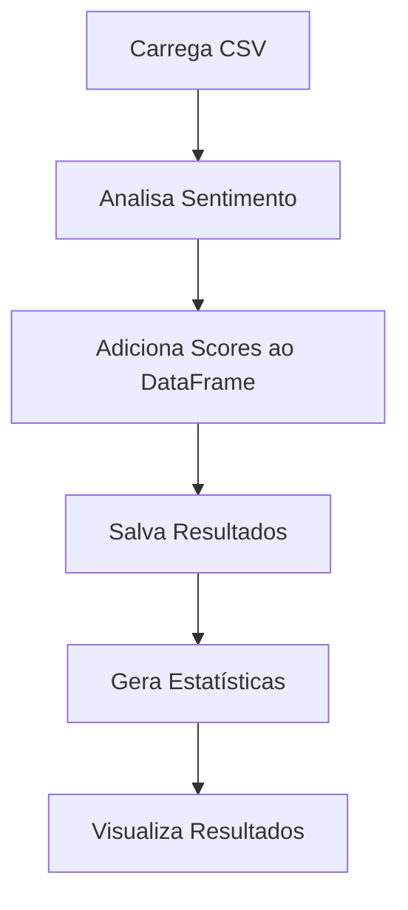

# Análise de Sentimento de Notícias de Ações Brasileiras

## Visão Geral

Este notebook Jupyter realiza as seguintes operações:

- Carrega notícias de ações brasileiras de um arquivo CSV
- Realiza análise de sentimento usando o modelo FinBERT
- Gera estatísticas e visualizações dos resultados
- Salva os resultados em um novo arquivo CSV

## Requisitos

```
- Python 3.x
- pandas
- torch
- transformers
- tqdm
- matplotlib
```

## Estrutura do Código

### Importações e Configurações Iniciais

```python
import os
import pandas as pd
import torch
from transformers import AutoTokenizer, AutoModelForSequenceClassification
from tqdm import tqdm
import matplotlib.pyplot as plt
from datetime import datetime

today = datetime.today().strftime('%d-%m-%Y')
os.environ['HF_HUB_DISABLE_SYMLINKS_WARNING'] = '1'

model_name = "ProsusAI/finbert"
tokenizer = AutoTokenizer.from_pretrained(model_name)
model = AutoModelForSequenceClassification.from_pretrained(model_name)
```

### Funções Principais

1. `get_sentiment_scores(text)`
   - Analisa o sentimento de um texto
   - Retorna: tuple (positive_score, negative_score, neutral_score)

2. `analyze_sentiment(csv_file)`
   - Processa o arquivo CSV e realiza análise de sentimento
   - Retorna: DataFrame com scores e sentimentos

### Fluxo de Execução



## Uso

1. Certifique-se de que o arquivo CSV com as notícias está no caminho correto:
   ```python
   csv_file = r'C:\Users\berna\sentiment_analysis\br_market\data\raw\brazilian_stocks_03-10-2024_news.csv'
   ```

2. Execute o notebook célula por célula ou use "Run All"

3. Arquivo gerado:
   - `brazilian_stocks_news_with_finbert_sentiment_[DATA].csv`

## Customização

- Modelo de sentimento: Altere `model_name` para usar um modelo diferente
- Caminho do arquivo: Modifique `csv_file` para apontar para seu arquivo de notícias
- Visualizações: Adicione ou modifique os gráficos gerados ao final do notebook

## Resultados

O notebook gera:
1. Um arquivo CSV com scores de sentimento para cada notícia
2. Distribuição geral de sentimentos (Positivo, Negativo, Neutro)
3. Scores médios de sentimento por empresa

### Exemplo de Saída

```
Overall Sentiment Distribution:
Neutral    1951
Positive    652
Negative    419

Average Sentiment Scores by Ticker:
                                        positive_score  negative_score  neutral_score
company                                                                 
Sigma Lithium Corporation                     0.469698        0.050451       0.479851
Embraer S.A. ADR                              0.440943        0.098073       0.460983
Azul S.A. ADR                                 0.388063        0.158895       0.453042
...
```

## Notas

- A análise de sentimento é baseada apenas nos títulos das notícias
- O modelo FinBERT é especializado em textos financeiros, mas pode não capturar nuances específicas do mercado brasileiro

## Resolução de Problemas

Se encontrar erros:
1. Verifique se todas as bibliotecas estão instaladas corretamente
2. Certifique-se de que o arquivo CSV está no formato correto e no caminho especificado
3. Em caso de erros de memória, considere processar o DataFrame em lotes

## Contribuições

Contribuições são bem-vindas! Sugestões para melhorias:
- Implementar análise do corpo completo das notícias
- Adicionar análise temporal dos sentimentos
- Correlacionar sentimentos com movimentos do mercado