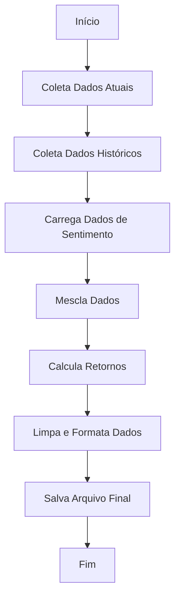

# Análise de Ações Brasileiras

## Visão Geral

Este script Python realiza as seguintes operações:

- Coleta dados de ações brasileiras
- Processa informações históricas
- Integra análises de sentimento de notícias
- Calcula retornos de investimentos
- Gera relatórios consolidados

## Requisitos

```
- Python 3.x
- yfinance
- pandas
- numpy
- scipy
```

## Estrutura do Código

### Funções Principais

1. `get_stock_data(ticker)`
   - Coleta dados atuais de uma ação
   - Retorna: dict com informações da ação

2. `get_historical_data(ticker)`
   - Obtém dados históricos desde 2005
   - Retorna: DataFrame com histórico de preços

3. `calculate_cumulative_return(df, ticker, date, n_days)`
   - Calcula retorno cumulativo
   - Parâmetros:
     - `df`: DataFrame com dados históricos
     - `ticker`: símbolo da ação
     - `date`: data inicial
     - `n_days`: número de dias para cálculo
   - Retorna: float (retorno percentual)

4. `parse_sentiment_date(date_str)`
   - Converte strings de data para formato padrão
   - Retorna: objeto datetime.date

5. `main()`
   - Função principal que executa todo o processo

### Fluxo de Execução



## Uso

1. Prepare o ambiente:
   ```bash
   pip install yfinance pandas numpy scipy
   ```

2. Execute o script:
   ```bash
   python script_analise_acoes.py
   ```

3. Arquivos gerados:
   - `brazilian_stocks_current_data_[DATA].csv`
   - `brazilian_stocks_historical_data_[DATA].csv`
   - `brazilian_stocks_with_sentiment_and_historical_data_[DATA].csv`

## Customização

- Lista de ações: Modifique a lista `tickers` na função `main()`
- Período histórico: Ajuste a data em `get_historical_data()`
- Períodos de retorno: Altere a lista em `for days in [1, 3, 7]:`

## Notas

- O script usa delays aleatórios para evitar limitações de API
- Certifique-se de ter uma conexão estável à internet
- O tempo de execução varia conforme o volume de dados

## Resolução de Problemas

Se encontrar erros:
1. Verifique sua conexão com a internet
2. Confirme se todas as bibliotecas estão instaladas
3. Cheque se o arquivo de sentimentos está no diretório correto
